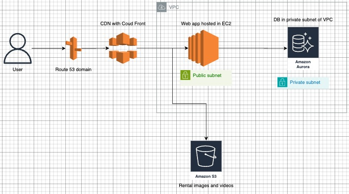

# Rental Listing Web App

This is a full-stack rental listing application where users can create and view rental property listings.

-----------------------------------------------------------------------
# Tech Stack

**Frontend**: React.js + Vite + MaterialUI

**Backend**: Express.js

**Database**: MySQL

**Deployment**: Docker, docker compose

-----------------------------------------------------------------------
# Requirement to run the code
download docker desktop 

-----------------------------------------------------------------------
# Steps to run with docker

1) git clone git@github.com:ssathyanaray2/RentalListing.git

2) cd app

3) docker compose up --build

4) use http://localhost:3000 in a browser to access the application

-----------------------------------------------------------------------
# Steps to run without docker
**Backend**:

    1) cd app/server

    2) npm install

    3) npm start

**Frontend**:

    1) cd app/client/rental-ui

    2) npm install

    3) npm run dev

    4) use http://localhost:3000 in a browser to access the application

-----------------------------------------------------------------------
# The services and related url:

Frontend: http://localhost:3000

Backend: http://localhost:8000

-----------------------------------------------------------------------
# Highlights:

1) View the stored rental listing in the ui

2) create a new rental listing

3) Dockerized the application and database. I believe in dockerizing the application as it is easy to share and standardize the process and also enables in seeding the database.

4) I have used express-generator and vite to create application skeleton.

-----------------------------------------------------------------------
# Interesting ways to build on the project:

1) Add Linters: As JS is a scripting language adding linters will greatly help.

2) Pagination Support: As the number of rental listing grows, loading all data at once can impact performance. Pagination is an important feature that greatly helps in performance improvement. Example: fetch and display 30 rentals and create a pagination element to fetch next 30 when the user requests.

3) Dynamic Image Uploads: As of now I have used a generic image for all the listing, if the application is deployed in AWS, S3 can be used to store and retrieve images efficiently and securely.

4) AWS Architecture and CI/CD:

   Outlining a simple architecture plan for the app in AWS, along with some ideas for CI/CD

   1) EC2: We can use AWS EC2 to deploy the web app, and utilize application load balancer (ALB) for scaling.
      
   2) Route 53: For custom domain and DNS routing.
      
   3) Aurora: It is AWS managed MySQL DB engine. Its a bit pricey, so if cost is a factor, we can use MySQL DB.
      
   4) S3: User media like images and videos can be stored in S3.

   CI/CD

    5) Github Actions: To run tests and create docker image which can be pushed to Elastic container registry (ECR).
       
    6) Lambda Deployment Trigger: Use an AWS Lambda function to pull the latest image from ECR and deploy it on the EC2 instance, automating the deployment step.

    
-----------------------------------------------------------------------

